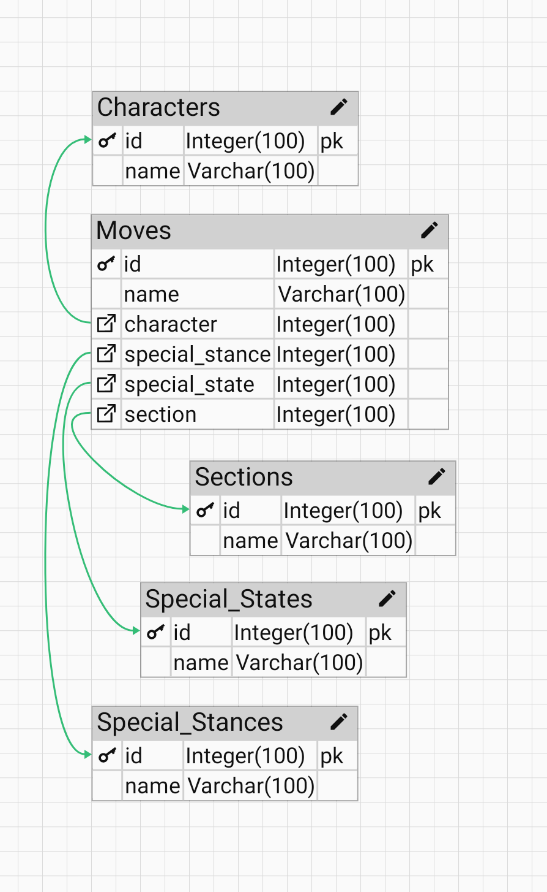

<h1 align="center">Salty Frames</h1>
<p align="center">
    
</p>
<p align="center">
    <a href="#overview">Overview</a>
    <a href="#architecture">Architecture</a>
    <a href="#installation">Installation</a>
    <a href="#usage">Usage</a>
    <a href="#license">License</a>
    <a href="#acknowledgements">Acknowledgements</a>
</p>

<h2 align="center">Overview</h2>
<hr>
<p>Salty Frames is a fighting game frame data application. While there are many applications of these kind in the market, my implementation is designed to be pragmatic in the sense that updates to the data are as automated as possible. From my experience, other developers and myself included have struggled with data changing very oftenly and when we're dealing with frame data we're dealing with many entries per character so it is not feasible for a single developer to update data manually on his or her own. One solution is to collect the data with an automation tool. For instance, my frame data for Soulcalibur is pulled from 8 Way Run - a wiki where approved users can enter frame data. (I have received permission to do this with the condition that I save the data into my own database which I have). That is what I mean by collecting the data. This is a common procedure for data mining projects. Every time the data changes, which I can tell by saving a timestamp into my models for each character, I re-collect the data. <br> Salty Frames also provides an API for other users to create their own frame data apps. From my experience the community that likes these kind of video games has a lot of developers and they all have their own frameworks, tools and takes on the frame data genre. Only one other developer who I've known before making this project. The API is provided thanks to the Django Rest Framework or DRF. That is why you can see the generic views on some of the API endpoints made by the DRF.
</p>

<h2 align="center">Architecture</h2>
<hr>
<p align="center">

</p>
<p>Explanation: the raw data is the data that I'm pulling from the web. Be it 8 Way Run, or wherever else I would need to. My Django project is designed to pull the data from the web with the Python request module. Then with Django's model API, I save the data into my PostgreSQL database so that I may refer to the data whenever I need to use it. This is assuming no bad data, which there is a lot of. Once I have the data in my own database, I use the Django REST Framework to pass the data in the form of a RESTful API. The client can be REACT Native, Angular, REACT or with pure Django (though the latter it can be argued that it's more efficient to pull data straight from the model API). This architecture can replicated with a different stack.</p>
<p align="center">

</p>
<p>Explanation: This database was designed for the Soulcalibur VI section. The Character table is the starting point to the architecture. In this app there will be around 30 characters because in the game that's how many there actually are, though there may be more in the future. Intuitively, a character has many moves, typically around 60-100. So it's a one-to-many relationship. The Moves table is actually the "meat" ofthe app. WE can think of a Section as a category. In every Soulcalibur game, there is a command list that lists the inputs of the moves for every character in the game's pause menus. The moves are separated as Horizontal, Vertical, Kicks, Dual-Buton Attacks and so on. More info here: https://8wayrun.com/wiki/editing-guide/#sectioning . This is a one-to-many relationship from the Section view. A move can only be assigned one section but there are 9 sections that can be assigned. A Special Stance is an in-game mechanic where a Move can only be performed if the character is in that stance. A move can have 0 or one stances. Special states work similarily, except that they work independently of stances.

To fit everything in one image, a lot of information has been left out of the diagram. Actually, this is what one of the models looks like:

```
class Character(models.Model):
    name = models.CharField(max_length=30, unique=True)

    # game version
    version = models.FloatField(null=True, blank=True)

    # when the character was added to the database (my database - the Saltyframes database)
    date_time_db_entry = models.DateTimeField(auto_now=True)

    # when the character's frame data was updated by the source
    date_time_version = models.DateTimeField(editable=True)

    # every frame data page on the source for a character has a slug different from the name field. In the common case it's their first name in lower case but sometimes it's not
    slug = models.CharField(max_length=30, null=True, blank=True, unique=True)

    def __str__(self):
        return self.name
```
</p>

<h2 align="center">Installation</h2>
<hr>
Git clone the latest commit on the master branch or download the ZIP file and unzip it somewhere you like. Create a virtual environment of your choice. <br>In that virtual environment, navigate to the directory that contains manage.py and run

```
pip install -r requirements.txt
```

<br>This will install all of the requirements that I installed to bring this app to its current state. <br><br>Next, as a typical Django project run:

```
python manage.py migrate
```

```
python manage.py runserver
```

```
python manage.py createsuperuser
```

Enter your desired super user details and you're up to speed.

<h2 align="center">Usage</h2>
<hr>
Navigate to the official production link:
https://www.saltyframes.com

And there you can navigate to the Soulcalibur VI section to choose a character whose frame data you want to see. You'll notice that the templates are generic views. This is to serve as a stand-in while I finish all of the backend aspects of the project and the presentation logic would have to be developed with a frontend tool. See issue #13.


<h2 align="center">License</h2>
<hr>
<p>
This project is intentionally unlicensed. It is a proprietary software governed by US copyright law with strong copyleft. While you may look at the code, you are not allowed to replicate or redistribute it in any way, in whole or in part. Github TOS says that you can view this repository and fork it, as I set it to public but that doesn't necesarily make it open source. Copyright (C) Ray Garcia. I reserve the right to grant other developers redistribution rights on a case-by-case basis.
</p>

<h2 align="center">Acknowledgements</h2>
<hr>
<p>There are several people I have to thank for making this possible.<br><br>Coding for Entrpreneurs - a virtual academy centered around Django projects. I learned Django, the Django Rest Framework, Linode, Heroku and other tools with his tutorial series's.<br><br>8 Way Run - an online wiki for Soulcalibur. They have editors providing frame data for every Soulcalibur game. I was given permission by them to use their data with the condition that I save the data that I use into my own database. <br><br>Bandai Namco and Project Soul - they are the publisher and developer respectively for Soulcalibur VI. I'm very passionate for this video game and wanted to create a programming project with this game as a topic.</p>

Salty Frames


Django - the backend framework:<br>
the Django Software Foundation


Django REST API - a third party framework for creating RESTful API's:<br>
https://www.django-rest-framework.org/


Linode - for static files:<br>
https://www.linode.com/

Heroku:<br>
a cloud service for hosting web applications. 
